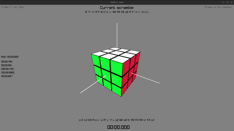

# cRubik



> [!WARNING]
> This software is unfinished. Keep your expectations low.

Sources:

- https://www.raylib.com/examples.html
- https://www.raylib.com/cheatsheet/cheatsheet.html

- https://www.dil.univ-mrs.fr/~regis/c-sys/index.html

- https://en.wikipedia.org/wiki/Spherical_coordinate_system
- https://ruwix.com/the-rubiks-cube/notation/
- https://www.javatpoint.com/rotate-matrix-by-90-degrees-in-java
- https://www.worldcubeassociation.org/regulations/#article-4-scrambling
- https://en.cppreference.com/w/c/io/fprintf
- https://en.cppreference.com/w/c/string/byte/strcpy
- https://en.cppreference.com/w/c/experimental/dynamic/strdup
- https://www.speedsolving.com/wiki/index.php/Scrambling

- https://github.com/hkociemba/CubeExplorer
- https://github.com/hishamcse/Rubiks-Cube-Solver

- https://ruwix.com/the-rubiks-cube/rubiks-cube-patterns-algorithms/

- https://github.com/DaveGamble/cJSON

## Current functionalities:

- **3D cube visualization** (any NxNxN size up to 9x9x9):
  - Face, slice, and whole-cube rotations.
  - Reset to solved state.
  - Configurable rotation animation speed.
  - Camera orbit / zoom.
- **Scramble generation** for any cube size.
- **WCA-style timer**:
  - Hold space to arm (turns green), release to start, any key to stop.
  - Average of 5 (Ao5) computed over the most recent solves.
  - Per-cube-size history (`times/3.time`, `times/4.time`, ...).
  - Mark past solves as `+2` or `DNF` from the time list.
- **Kociemba two-phase solver** (3x3x3 only, ~100ms per solve, typically 20–22 moves).
  - Solution displayed as a move list, with an Apply button to animate it on the cube.
  - Two output modes: re-orient cube to canonical, or preserve current view.
- **Patterns screen**: apply named visual patterns (Superflip, Cube in a Cube, …) as animated playbacks.
- **Options screen**:
  - Rebind every rotation key (works on AZERTY/QWERTY).
  - Change rotation animation speed.
  - Choose solver output mode.
  - Persisted to `options.json`.

## Controls

Defaults: every rotation key is rebindable in the Options screen.

### Cube manipulation

| Key                  | Action                                  |
| -------------------- | --------------------------------------- |
| `R` / `L` / `U` / `D` / `F` / `B` | Face turn (clockwise)        |
| `M` / `E` / `S`      | Slice turn (clockwise)                  |
| `X` / `Y` / `Z`      | Whole-cube rotation (clockwise)         |
| `Alt` + any of above | Counter-clockwise variant               |

### Timing & solving

| Key                          | Action                                                   |
| ---------------------------- | -------------------------------------------------------- |
| `Enter`                      | Generate a new scramble                                  |
| `Space` (hold ≥ 0.3s, then release) | Start the timer (WCA-style)                       |
| Any key while timer runs     | Stop timer, save the solve, generate next scramble       |
| `K`                          | Launch Kociemba solver (3x3x3 only)                      |
| `+` / `Page Up`              | Increase cube size                                       |
| `-` / `Page Down`            | Decrease cube size                                       |

### Mouse

| Action               | Effect                                          |
| -------------------- | ----------------------------------------------- |
| Drag left button     | Orbit the camera                                |
| Wheel                | Zoom                                            |
| Middle button        | Reset camera                                    |
| Right button         | Reset cube to solved                            |

### Screens

| Key      | Action                              |
| -------- | ----------------------------------- |
| `H`      | Toggle help screen                  |
| `O`      | Toggle options (saves on exit)      |
| `P`      | Toggle patterns screen              |
| `Esc`    | Open quit confirmation dialog       |

## Usage

Because we are using Raylib and RayGui, make sure the following libraries are installed:

```
libx11-dev libxrandr-dev libxi-dev libgl1-mesa-dev libglu1-mesa-dev libxcursor-dev libxinerama-dev libwayland-dev libxkbcommon-dev
```

Run the following command to compile and run the project:

```bash
make && ./cRubik
```

or

```bash
make run
```
